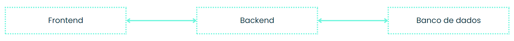
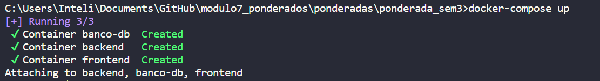
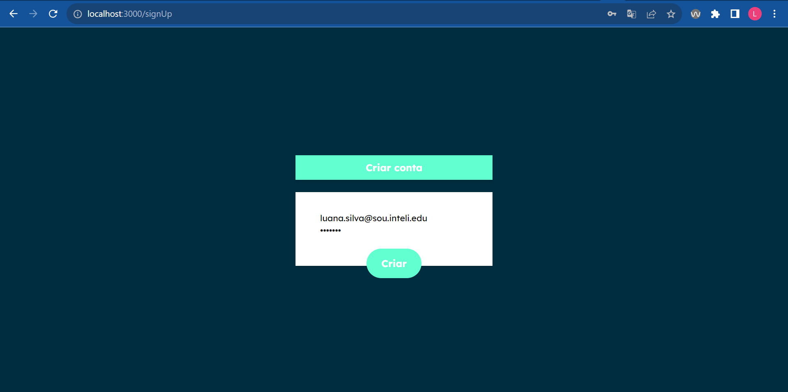
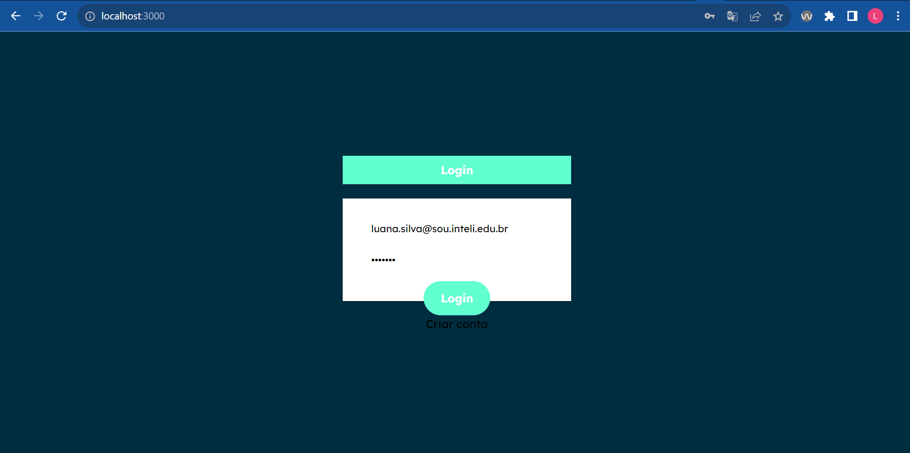
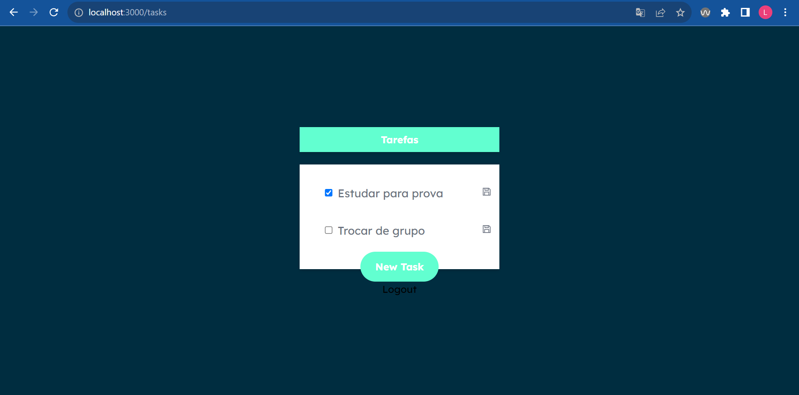
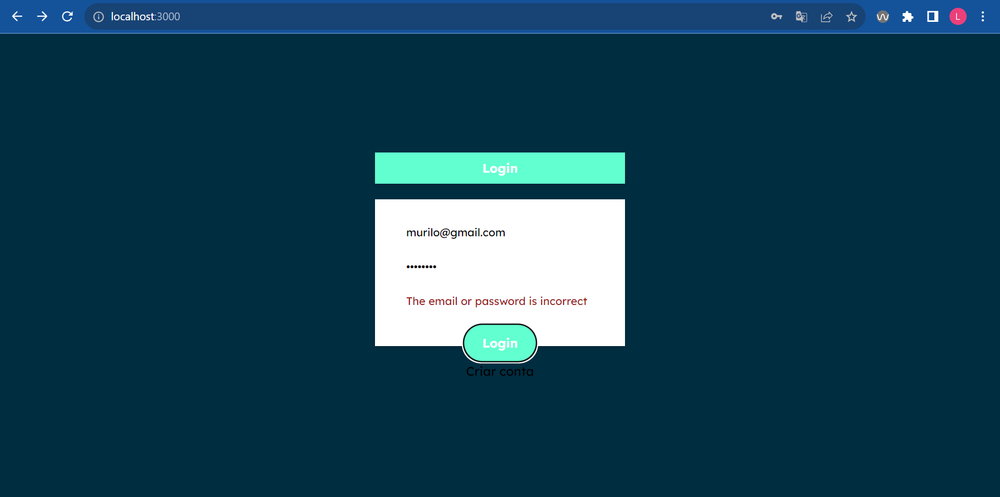

# Atividade 2

Esta atividade tem por objetivo desenvolver um projeto web que possibilite os usuários registrarem dados em um banco de dados. O deploy do banco, da API do backend e do frontend deve acontecer utilizando uma aplicação com multiplos containers. A aplicação não precisa utilizar frameworks, pode ser realizada utilizando os primitivos presentes na linguagem de programação escolhida.

#### Divisão do projeto em containers:
Para os projetos que vão trabalhar com 2 containers:
- Container da aplicação (interface e backend);
- Container do banco de dados.

Para os projetos que vão trabalhar com 3 containers:
- Container da interface com o usuário (frontend da aplicação);
- Container do sistema de API (backend da aplicação);
- Container do banco de dados.

A escolha de uma das estratégias está totalmente vinculada a experiência que o estudante deseja praticar. De qualquer forma, será encessário justificar a escolha da arquitetura utilizada para a solução. 

#### Espera-se encontrar na entrega do projeto:
1. Arquitetura da solução utilizada (no arquivo README do projeto) e a justificativa de sua escolha;
2. Um arquivo docker-compose para o lançamento da aplicação;
3. Instruções para lançar a aplicação;
4. Instruções para utilizar a aplicação;
5. Uma descrição da estrutura de dados utilizada para armazenar os dados no banco de dados;
6. Uma tela de login para entrar no sistema;
7. Uma tela para ver os dados cadastrados;
8. Uma tela para cadastrar novas entradas de dados.

O projeto consiste em um TODO List, onde o usuário deve se cadastrar no sistema (considerar o usuário teste, com a senha teste123) para ter acesso a suas notas e adicionar novas notas. NÃO É NECESSÁRIO REALIZAR A IMPLEMENTAÇÃO DE CADASTRO DE USUÁRIOS OU TELA/FUNCIONALIDADE DE RECUPERAÇÃO DE SENHA.

A imagem do banco de dados que será utilizada pode ser de qualquer banco de dados RELACIONAL. A aplicação pode ser desenvolvida em Python ou em JavaScript.

Exemplos de aplicação do tipo TODO List: todoist, Any.do, Google Keep

# Arquitetura
A arquitetura da aplicação envolve três contêineres customizados, que são construídos, executados e conectados usando o Docker Compose:



banco-db: Contêiner que utiliza a base de dados PostgreSQL, configura as variáveis de ambiente necessárias e expõe a porta 5432 para a comunicação com o banco de dados.

backend: Contêiner baseado na imagem Node Alpine, servindo como o backend da aplicação, desenvolvido em Node.js, ele expõe a porta 5000 para a comunicação com o frontend e o acesso às APIs da aplicação.

frontend: Contêiner é baseado na imagem Next.js Alpine, é o frontend da aplicação, desenvolvido em Next.js (baseado em React) e expõe a porta 3000 para que os usuários possam acessar a interface da aplicação.



**Banco de dados**
O banco de dados é composto por duas tabelas relacionadas:

tasks: Armazena informações sobre as tarefas (título, estado de conclusão e referência ao usuário através do campo user_id, possui timestamps de criação e atualização).

users: Armazena informações dos usuários (email, senha e timestamps de criação e atualização, possui uma chave primária).

**Funcionalidades da aplicação**
- Criação de usuário
- Login e Logout
- Criação de tarefas
- Marcar tarefas como concluídas ou não concluídas
- Exclusão de tarefas
- Atualização de tarefas

Todas essas operações são realizadas através de rotas protegidas que exigem autenticação. A autenticação é implementada usando JSON Web Tokens (JWT), com um tempo de expiração de 5 minutos.

Seguem abaixo algumas imagens da interface, considerando tela de login, feedback de login incorreto, tela de criação de conta e tela de tarefas com atualização.






## Estrutura de pastas

```
├───/backend
├───/frontend 
└───docker-compose
```
#### /backend
- **config**: Configurações da aplicação
- **controllers**: Controladores que preparam o input do usuário para os serviços
- **middlewares**: Middlewares da aplicação
- **models** e **routes**: Definições dos modelos de dados e rotas da app
- **services**: Regras de negócio com manipulação direta do banco de dados

#### /frontend
- **.next**: Artefatos de construção do Next.js
- **app**: Módulos ou seções do frontend
- **components**: Componentes reutilizáveis
- **context**: Gerenciamento de estado global da aplicação
- **public**: Ativos estáticos públicos

# Execução
Para executar a aplicação, siga os seguintes passos:
1. Instalação do Docker e Docker Compose
2. Navegar até a pasta raiz do projeto pelo CMD
3. Executar o comando `docker-compose up`
4. É esperado que as imagens sejam baixadas do DockerHub e os contêineres sejam criados
5. Acesse http://localhost:3000 para começar a usar a aplicação
