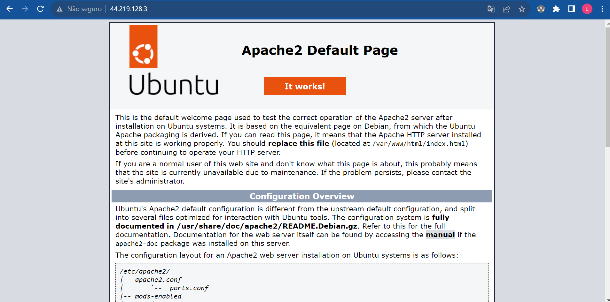
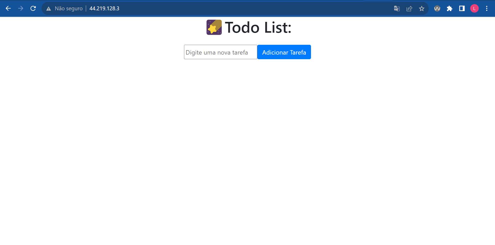
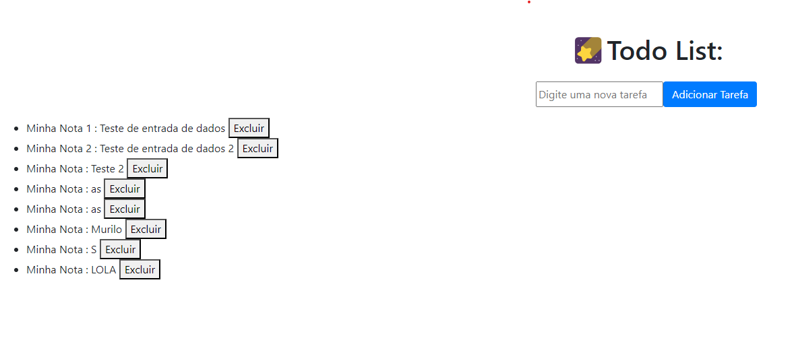

# Avaliação P2

## Passo 1 - EC2
Em primeiro lugar foram criadas as instâncias do backend e frontend, ou seja, duas EC2. 


Aqui já podemos ver que foram criadas as duas instâncias que já estão sendo executadas, com IP elástico já alocados nelas.


## Passo 2 - RDS
Posto isso, foi criado o RDS (database-prova2) com todas as configurações necessárias, além de deixar acessivelmente público. Ademais, com as informações desse banco, foi alterado os dados para conexão com o banco de dados no código de backend.

Então, configuramos também os grupos de segurança dele, em inbound rules, para receber conexões TCP de todos os IPs (0.0.0.0).


## Passo 3 - Backend
Na instância backend-prova2, tais comandos foram utilizados:

```bash
sudo apt update
sudo apt upgrade
sudo apt install python3 python3-pip -y
sudo git clone https://github.com/luanaparra/modulo7_ponderados
python3 -m pip install -r requirements.txt
```
Posto isso, rodamos o arquivo criar_banco.py.

## Passo 4 - Frontend
Na instância frontend-prova2, os seguintes comandos foram utilizados:

```bash
sudo apt update
sudo apt upgrade
sudo apt install apache2
```
O último comando é necessário, pois vamos servir o frontend com Apache. A fim de conferência o IP foi acessado e aparece essa página abaixo:



Assim, foi clonado este repositório com as urls modificadas. Dessa maneira, foi possível 

```bash
sudo cp ./modulo7_ponderados/provas/p2/frontend/index.html /var/www/html
```

# ENTREGA FINAL:





